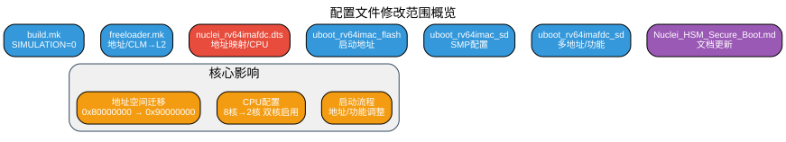
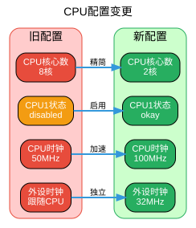
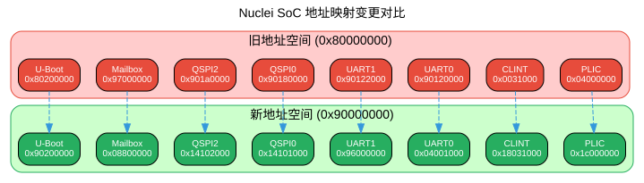

# Nuclei Linux SDK 配置文件修改分析报告

## 📋 概述

本文档详细分析了 `conf/evalsoc/` 目录下配置文件的修改内容，这些修改主要涉及地址空间重构、硬件配置更新和启动参数调整，目的是适配新的硬件平台版本。

### 修改统计

| 文件 | 修改类型 | 影响范围 |
|------|----------|----------|
| `build.mk` | 默认值调整 | 编译配置 |
| `freeloader.mk` | 地址/参数变更 | Bootloader配置 |
| `nuclei_rv64imafdc.dts` | 大规模重构 | 设备树 |
| `uboot_rv64imac_flash_config` | 地址迁移 | U-Boot配置 |
| `uboot_rv64imac_sd_config` | 功能开关 | U-Boot配置 |
| `uboot_rv64imafdc_sd_config` | 多地址调整 | U-Boot配置 |
| `Nuclei_HSM_Secure_Boot.md` | 文档重写 | 文档资料 |

---

## 📊 修改范围概览



---

## 🔧 详细修改分析

### 1. build.mk - 编译配置调整

#### 修改内容

```diff
- SIMULATION ?=
+ SIMULATION ?= 0
```

#### 作用说明

- **修改前**：`SIMULATION` 默认为空，可能继承环境变量或保持未定义状态
- **修改后**：显式设置为 `0`，禁用QEMU仿真模式
- **影响**：编译系统将针对**实际硬件环境**进行配置，而非仿真器环境

---

### 2. freeloader.mk - Bootloader核心配置

#### 修改内容

```diff
- ENABLE_CLM ?= 1
+ ENABLE_L2 ?= 1
- AMPFW_START_OFFSET ?= 0xbE000000
+ AMPFW_START_OFFSET ?= 0x7E000000
```

#### 作用说明

| 参数 | 旧值 | 新值 | 说明 |
|------|------|------|------|
| `ENABLE_CLM` | 1 | - | 启用Cluster Local Memory（已废弃） |
| `ENABLE_L2` | - | 1 | 启用二级缓存（新命名） |
| `AMPFW_START_OFFSET` | 0xbE000000 | 0x7E000000 | AMP固件起始地址 |

#### 关键变更

1. **术语统一化**：将CLM（Cluster Local Memory）统一更名为L2（二级缓存），符合业界标准命名
2. **地址空间调整**：AMP固件起始地址从 `0xbE000000` 迁移到 `0x7E000000`，调整了地址空间布局

---

### 3. nuclei_rv64imafdc.dts - 设备树大规模重构

这是本次修改中**变化最大的文件**，涉及CPU配置、地址映射、中断号等多个方面的调整。

#### 3.1 CPU配置变更



##### 时钟频率调整

```diff
- #define CPUCLK_FREQ         50000000
+ #define CPUCLK_FREQ         100000000
  
- #define PERIPHCLK_FREQ      CPUCLK_FREQ
+ #define PERIPHCLK_FREQ      32000016
```

| 参数 | 旧值 | 新值 | 变化 |
|------|------|------|------|
| CPU时钟 | 50 MHz | **100 MHz** | 2倍提升 |
| 外设时钟 | 跟随CPU时钟 | **32.000016 MHz** | 独立配置 |

##### CPU核心数精简

```diff
- 8核配置 (cpu0-cpu7)
+ 2核配置 (cpu0-cpu1)
```

**具体变更**：
- **删除**：cpu2、cpu3、cpu4、cpu5、cpu6、cpu7 节点
- **启用**：cpu1 状态从 `disabled` 改为 `okay`
- **结果**：从8核（仅cpu0启用）变为2核（cpu0和cpu1均启用）

#### 3.2 地址映射全面调整



##### 外设基址迁移表

| 外设 | 旧地址 | 新地址 | 地址空间变化 |
|------|--------|--------|--------------|
| **PLIC** | 0x04000000 | **0x1c000000** | 高位地址区 |
| **CLINT** | 0x00031000 | **0x18031000** | 高位地址区 |
| **UART0** | 0x90120000 | **0x04001000** | 低位地址区 |
| **UART1** | 0x90122000 | **0x96000000** | 高位地址区 |
| **QSPI0** | 0x90180000 | **0x14101000** | 独立地址区 |
| **QSPI2** | 0x901a0000 | **0x14102000** | 独立地址区 |
| **Mailbox** | 0x97000000 | **0x08800000** | 中位地址区 |

#### 3.3 中断号重新分配

```diff
  uart1: serial@96000000 {
      ...
-     interrupts = <4>;
+     interrupts = <34>;
  };

  qspi2: spi@14102000 {
      ...
-     interrupts = <8>;
+     interrupts = <7>;
  };

  mailbox: mailbox@8800000 {
      ...
-     interrupts = <21>;
+     interrupts = <17>;
  };
```

| 外设 | 旧中断号 | 新中断号 |
|------|----------|----------|
| UART1 | 4 | **34** |
| QSPI2 | 8 | **7** |
| Mailbox | 21 | **17** |

#### 3.4 性能优化

```diff
  mmc@0 {
      ...
-     spi-max-frequency = <2500000>;
+     spi-max-frequency = <20000000>;
      ...
  };
```

- **SD卡SPI频率**：2.5 MHz → **20 MHz**
- **性能提升**：8倍传输速度提升

#### 3.5 PLIC配置调整

```diff
  plic0: interrupt-controller@1c000000 {
      ...
-     riscv,ndev = <53>;
+     riscv,ndev = <64>;
      interrupts-extended =
            <&cpu0_intc 11 &cpu0_intc 9
-            &cpu1_intc 11 &cpu1_intc 9
-            &cpu2_intc 11 &cpu2_intc 9
-            &cpu3_intc 11 &cpu3_intc 9
-            &cpu4_intc 11 &cpu4_intc 9
-            &cpu5_intc 11 &cpu5_intc 9
-            &cpu6_intc 11 &cpu6_intc 9
-            &cpu7_intc 11 &cpu7_intc 9>;
+            &cpu1_intc 11 &cpu1_intc 9 >;
      ...
  };
```

- **中断设备数**：53 → **64**
- **中断扩展**：仅保留cpu0和cpu1的中断连接

---

### 4. uboot_rv64imac_flash_config - Flash启动配置

#### 修改内容

```diff
- CONFIG_TEXT_BASE=0x80200000
+ CONFIG_TEXT_BASE=0x90200000
- CONFIG_SYS_LOAD_ADDR=0x80200000
+ CONFIG_SYS_LOAD_ADDR=0x90200000
- CONFIG_CUSTOM_SYS_INIT_SP_ADDR=0x80200000
+ CONFIG_CUSTOM_SYS_INIT_SP_ADDR=0x90200000
- CONFIG_BOOTCOMMAND="bootm 0x83000000 0x88300000 0x88000000"
+ CONFIG_BOOTCOMMAND="bootm 0x93000000 0x98300000 0x98000000"
```

#### 作用说明

U-Boot启动地址从 `0x80000000` 空间整体迁移到 `0x90000000` 空间：

| 参数 | 旧值 | 新值 | 说明 |
|------|------|------|------|
| `TEXT_BASE` | 0x80200000 | 0x90200000 | 代码段基址 |
| `SYS_LOAD_ADDR` | 0x80200000 | 0x90200000 | 加载地址 |
| `SYS_INIT_SP_ADDR` | 0x80200000 | 0x90200000 | 栈指针初始地址 |
| `BOOTCOMMAND` | 0x83/0x88x | 0x93/0x98x | 镜像加载地址 |

---

### 5. uboot_rv64imac_sd_config - SD启动配置（rv64imac）

#### 修改内容

```diff
+ # CONFIG_SPL_SMP is not set
```

#### 作用说明

- **禁用SPL阶段多核支持**（SMP）
- 适用于单核启动场景或资源受限环境

---

### 6. uboot_rv64imafdc_sd_config - SD启动配置（rv64imafdc）

#### 6.1 关键地址变更

```diff
- CONFIG_SPL_STACK=0x80040000
+ CONFIG_SPL_STACK=0x90040000
- CONFIG_SPL_LOAD_FIT_ADDRESS=0xa0060000
+ CONFIG_SPL_LOAD_FIT_ADDRESS=0xC0000000
- CONFIG_SPL_BSS_START_ADDR=0x8001a000
+ CONFIG_SPL_BSS_START_ADDR=0x9001a000
- CONFIG_CUSTOM_SYS_SPL_MALLOC_ADDR=0xe0000000
+ CONFIG_CUSTOM_SYS_SPL_MALLOC_ADDR=0x90100000
```

| 参数 | 旧值 | 新值 | 说明 |
|------|------|------|------|
| `SPL_STACK` | 0x80040000 | 0x90040000 | SPL栈地址 |
| `LOAD_FIT_ADDRESS` | 0xa0060000 | **0xC0000000** | FIT镜像加载地址 |
| `BSS_START_ADDR` | 0x8001a000 | 0x9001a000 | BSS段起始地址 |
| `MALLOC_ADDR` | 0xe0000000 | 0x90100000 | malloc内存地址 |

#### 6.2 新增功能配置

```diff
+ # CONFIG_SPL_SMP is not set
+ CONFIG_SPL_SMP=y 
+ CONFIG_SPL_SERIAL_SUPPORT=y
+ CONFIG_SPL_LOGLEVEL=4
```

| 配置项 | 作用 |
|--------|------|
| `SPL_SMP` | 同时配置禁用和启用（可能是调试配置） |
| `SPL_SERIAL_SUPPORT` | **启用SPL阶段串口支持** |
| `SPL_LOGLEVEL=4` | **设置SPL日志级别为4**（详细日志） |

---

### 7. Nuclei_HSM_Secure_Boot.md - 安全启动文档更新

#### 修改统计

- **新增行数**：955行
- **删除行数**：968行
- **净变化**：-13行（主要重写和重组）

#### 主要更新内容

1. **地址引用更新**：所有示例地址更新为新地址映射
2. **术语统一**：CLM → L2 的命名变更
3. **双核配置说明**：添加双核硬件平台的启动说明
4. **文档结构优化**：重新组织章节，提升可读性

---

## 🎯 修改核心意图总结

### 1. 地址空间重构（核心变更）

**所有关键地址从 `0x80000000` 空间迁移到 `0x90000000` 空间**

这是本次修改的**最核心变更**，影响范围涵盖：
- U-Boot启动地址
- SPL运行地址
- 外设寄存器映射
- 固件加载地址

### 2. 硬件平台适配

**CPU配置精简**：8核 → 2核
- 符合实际双核硬件平台
- 启用第二核（cpu1）
- 删除未使用的cpu2-cpu7节点

### 3. 性能优化

- **CPU频率提升**：50MHz → 100MHz（2倍提升）
- **SD卡传输提速**：2.5MHz → 20MHz（8倍提升）
- **外设时钟独立**：不再依赖CPU时钟

### 4. 术语标准化

- CLM（Cluster Local Memory）→ **L2（二级缓存）**
- 符合业界标准命名规范

### 5. 调试能力增强

- 启用SPL阶段串口支持
- 设置详细日志级别（LOGLEVEL=4）
- 禁用仿真模式，使用实际硬件配置

---

## ⚠️ 注意事项

### 兼容性影响

1. **固件不兼容**：旧版本固件无法在新硬件上运行，必须重新编译
2. **工具链配置**：需要更新链接脚本以匹配新地址空间
3. **烧录地址变更**：Flash烧录工具需要更新地址参数

### 迁移建议

1. **重新编译完整SDK**：所有组件（SPL、U-Boot、Kernel）都需要重新编译
2. **更新烧录脚本**：修改烧录工具的地址参数
3. **验证外设驱动**：确认所有外设驱动使用新的寄存器地址
4. **测试中断功能**：验证中断号变更后的中断处理是否正常

---

## 📚 附录

### A. 完整地址映射对比表

| 组件 | 旧地址 | 新地址 | 变更类型 |
|------|--------|--------|----------|
| U-Boot Text Base | 0x80200000 | 0x90200000 | 整体迁移 |
| SPL Stack | 0x80040000 | 0x90040000 | 整体迁移 |
| SPL BSS | 0x8001a000 | 0x9001a000 | 整体迁移 |
| PLIC | 0x04000000 | 0x1c000000 | 重新映射 |
| CLINT | 0x00031000 | 0x18031000 | 重新映射 |
| UART0 | 0x90120000 | 0x04001000 | 重新映射 |
| Mailbox | 0x97000000 | 0x08800000 | 重新映射 |
| QSPI0 | 0x90180000 | 0x14101000 | 重新映射 |
| FIT Load Address | 0xa0060000 | 0xC0000000 | 整体迁移 |

### B. 相关文件路径

- `conf/evalsoc/build.mk` - 编译配置
- `conf/evalsoc/freeloader.mk` - Bootloader配置
- `conf/evalsoc/nuclei_rv64imafdc.dts` - 设备树
- `conf/evalsoc/uboot_rv64imac_flash_config` - Flash启动配置
- `conf/evalsoc/uboot_rv64imac_sd_config` - SD启动配置（imac）
- `conf/evalsoc/uboot_rv64imafdc_sd_config` - SD启动配置（imafdc）
- `conf/evalsoc/Nuclei_HSM_Secure_Boot.md` - 安全启动文档

---

*文档生成时间：2026年4月1日*
